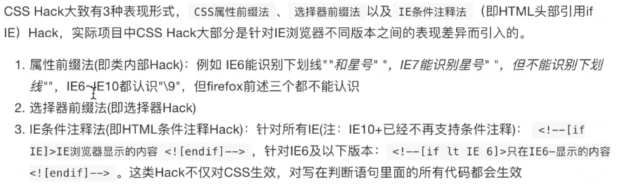
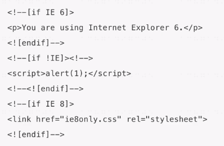

# 其他

## overflow：hidden

1. 隐藏溢出内容
2. 清浮动
3. 解决margin-top传递问题

## BFC

1. Box: CSS布局的基本单位
　　Box 是 CSS 布局的对象和基本单位， 直观点来说，就是一个页面是由很多个 Box 组成的。元素的类型和 display 属性，决定了这个 Box 的类型。 
   不同类型的 Box， 会参与不同的 Formatting Context（一个决定如何渲染文档的容器），因此Box内的元素会以不同的方式渲染。让我们看看有哪些盒子：

block-level box:display 属性为 block, list-item, table 的元素，会生成 block-level box。并且参与 block fomatting context；
inline-level box:display 属性为 inline, inline-block, inline-table 的元素，会生成 inline-level box。并且参与 inline formatting context；
run-in box: css3 中才有。

2. Formatting context
　　Formatting context 是 W3C CSS2.1 规范中的一个概念。它是页面中的一块渲染区域，并且有一套渲染规则，它决定了其子元素将如何定位，以及和其他元素的关系和相互作用。
    最常见的 Formatting context 有 Block fomatting context (简称BFC)和 Inline formatting context (简称IFC)。

BFC(Block formatting context)直译为"块级格式化上下文"。它是一个独立的渲染区域，只有Block-level box参与， 它规定了内部的Block-level Box如何布局，并且与这个区域外部毫不相干。

### 创建BFC：
1. float属性不为none
2. overflow不为visible(可以是hidden、scroll、auto)
3. position为absolute或fixed、sticky
4. display为inline-block、table-cell、table-caption、flex、inline-flex
5. 根元素html

### BFC布局规则：
- 内部的Box会在垂直方向，一个接一个地放置。
- Box垂直方向的距离由margin决定。属于同一个BFC的两个相邻Box的margin会发生重叠
- 每个元素的margin box的左边， 与包含块border box的左边相接触(对于从左往右的格式化，否则相反)。即使存在浮动也是如此。
- BFC的区域不会与float box重叠。
- BFC就是页面上的一个隔离的独立容器，容器里面的子元素不会影响到外面的元素。反之也如此。
- 计算BFC的高度时，浮动元素也参与计算
 
### BFC 作用：
1. 清除浮动，解决父级元素高度塌陷（注:可以解决，但需注意带来的副作用）
2. 解决外边距合并的问题

### 渐进增强和优雅降级
 1. 渐进增强（progressive enhancement):针对低版本浏览器进行构建页面，保证最基本的功能，然后再针对高级浏览器进行效果、交互等改进和追加功能达到更好的用户体验
 2. 优雅降级（graceful degradation）：一开始就构建完整的功能，然后再针对低版本浏览器进行兼容

## CSS hack  
由于不同厂商的浏览器，或者同一厂商的浏览器的不同版本，对CSS的解析认识不完全一样，因此会导致生成的页面效果不一样，得不到我们所需要的页面效果。 
这个时候我们就需要针对不同的浏览器去写不同的CSS，让它能够同时兼容不同的浏览器，能在不同的浏览器中也能得到我们想要的页面效果

###  ie 的hack 写法
.box{
  color:red;
  _color :blue ;/* ie6 */
  *color:pink ; /* ie6、7 */
  color: yellow\9;  /* ie/edge 6-8 */
}

### 条件注释
基本结构和HTML的注释(<!– –>)是一样的。在IE以外的浏览器将会把它们看作是普通的注释而完全忽略它们。
IE将会根据if条件来判断是否如解析普通的页面内容一样解析条件注释里的内容。

### 浏览器兼容性的工具
- html5shiv.js：用于解决IE9以下版本浏览器对HTML5新增标签不识别，并导致CSS不起作用的问题
- respond.js：用于为 IE6-8 以及其它不支持 CSS3 Media Queries 的浏览器提供媒体查询的 min-width 和 max-width 特性，实现响应式网页设计（Responsive Web Design）
- css reset ：每个浏览器都有一套css默认样式，但并不是所有的浏览器都使用一样的属性值，css reset重置这些浏览器自带样式，以让网页的样式在各浏览器中表现一致。
- normalize.css：Normalize.css是一种CSS reset 的替代方案，normalize.css有下面这几个目的：
   1 保护有用的浏览器默认样式而不是完全去掉它们；
   2 一般化的样式：为大部分HTML元素提供；
   3 修复浏览器自身的bug并保证各浏览器的一致性。

- Modernizr：是一个 JavaScript 库，用于检测用户浏览器的 HTML5 与 CSS3 特性。Modernizr 会在页面加载后立即检测特性；然后创建一个包含检测结果的 JavaScript 对象，  
  同时在 html 元素加入方便你调整 CSS 的 class 名

- postCSS：它提供了一种方式用 JavaScript 代码来处理 CSS。它负责把 CSS 代码解析成抽象语法树结构（Abstract Syntax Tree，AST），再交由插件来进行处理。  
  插件基于 CSS 代码的 AST 所能进行的操作是多种多样的，比如可以支持变量和混入（mixin），增加浏览器相关的声明前缀，或是把使用将来的 CSS 规范的样式规则转译（transpile）成当前的 CSS 规范支持的格式.

