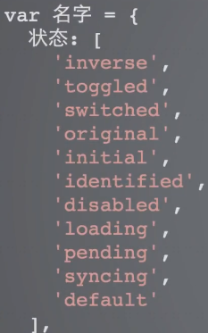
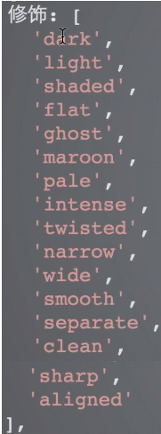
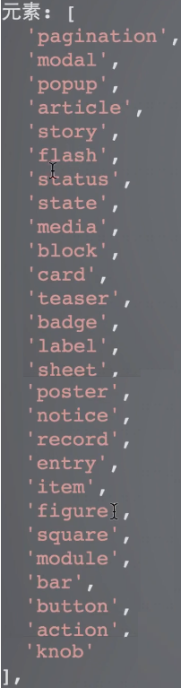
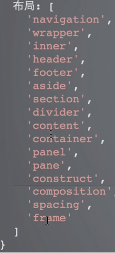

# 规范

## 命名规范
- 名称用小写
- 命名用引号包裹
- 用中横线连接 ，（如mod-modal）
- 命名体现功能，不涉及表现形式（颜色、字体、边框、背景等）

## 常见命名
- wrap 、 wrapper 外侧包裹
- container 、ct 包裹容器
- header
- body
- footer
- aside、sidebar
- content 主要内容
- navigation 导航
- pagenation 分页
- tab tab切换
- breadcrumbs 导航列表、面包屑
- dropdown 下拉菜单
- article
- main 主体
- thumbnail 头像、小头像
- media
- panel
- tooltip 放上弹出的提示
- popup 按下弹出的提示
- button 、btn
- ad 广告
- subnav 二级导航
- menu
- tag
- message、notice 提示消息
- summary 摘要
- logo 
- search
- login
- register 
- username
- password
- banner
- copyright
- modal 、dialog 弹窗

html5 新支持元素
* section 文档的一节，包含的是那种应该列入文档大纲或目录的内容，通常包含一个或多个段落及一个标题（标题非必须）
* header 首部
* footer 尾部
* nav 导航区域
* article 一段独立成篇的内容
* aside 附注栏，表示跟周边内容稍微沾一点边的内容，类似书籍或杂志的侧栏
* main 呈现了文档<body>或应用的主体部分
* details
* menu 

