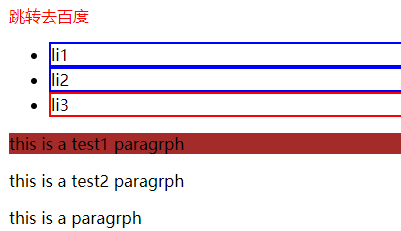
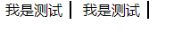

# css 选择器

## css基本选择器

* 元素选择器，如：div{ color:red; }
* 类选择器 ,如：.class1{color:yellow;}
* Id选择器，如 #id1{ color:blue;}
* 通配符选择器 *
* 属性选择器，如[href]{ border:thin solid black}


## 元素选择器
* 元素选择器可以分组 如:
 h2,p{ color:grey;}


## 类选择器
* 类选择器与元素结合
  h2.warning{color:red;}
warning1.warning2{color:red;} //拥有类为 class = "warning1 warning2"
* 多类选择器 (类名的顺序不限)

```
  .warning.urgent{background:silver}
  可匹配:
   <p class="urgent warning">this is paragraph</p>
  可匹配：
  <p class="urgent warning help">this is paragraph</p>
```
## ID 选择器
* 与类选择器类似，但文档中ID是惟一的
* ID属性不允许有以空格分隔的词列表


## 属性选择器

* 

> 简单属性选择器
> 具体属性值选择器
> E[attr|=val] :只能等于val，或以val-开头
> E[attr*=val] :包含val字符串
> E[attr~=val] :属性值多个，有一个是val；或仅有val
> E[attr^=val] :以val开头
> E[attr$=val] :以val结尾

```
1、 简单属性选择器 a[href] {font-weight：bold}

2、具体属性值选择器 a[title="W3C Home"]
 要求属性值完全匹配，顺序要一致

3、E[attr|=val]

 h1[lang|="en"]{color:red;}
匹配：<h1 lang="en">H1</h1>
     <h1 lang="en-us">H1</h1>
不匹配：<h1 lang="enaus">H1</h1>

4、E[attr*=val]
span[class*="cloud"]{color:silver;}
匹配： <span class="cloudy barren">Venus</span>
       <span class="life-bearing cloudy">Earth</span>

5、E[attr^=val]
span[class^="bar"]{color:silver;}
匹配： <span class="barren rocky">Venus</span>
不匹配： <span class="cloudy barren">Venus</span>

6、E[attr$=val]
span[class$="y"]{color:silver;}
匹配： <span class="barren rocky">Venus</span>
       <span class="life-bearing cloudy">Earth</span>
不匹配： <span class="cloudy barren">Venus</span

7、E[attr~=val]
span[class~="barren"]{color:silver;}
匹配： <span class="barren rocky">Venus</span>
       <span class="barren">Venus</span
不匹配： <span class="cloudy barrens">Venus</span
```


## 复合选择器
* 并集选择器，如a,p{ color:red;}
* 后代选择器，如p span{ color:red;},包含p中任意的span，不仅仅是子元素
* 子选择器，如 p>span{ color:red;}
* 相邻兄弟选择器，如p+span{ color:red;}
* 普通兄弟选择器，如p~span{ color:red;}，包含所有的兄弟，不仅仅是相邻的，只包括p后面的兄弟元素，不包含p前面的兄弟

## 伪类选择器
### 动态伪类选择器
* :linked
* :visited
* :hover
* :active
* :focus
* :target

```
<style>
#news1:target
{
border: 2px solid #D4D4D4;
background-color: #e5eecc;
}
</style>
</head>
<body>

<h1>这是标题</h1>

<p><a href="#news1">跳转至内容 1</a></p>  <!-- 跳转到内容1时 内容1的段落添加边框和背景色 -->
<p><a href="#news2">跳转至内容 2</a></p>

<p>请点击上面的链接，:target 选择器会突出显示当前活动的 HTML 锚。</p>

<p id="news1"><b>内容 1...</b></p>
<p id="news2"><b>内容 2...</b></p>

```


### 否定选择器
* :not，css3

### 结构性伪类选择器
* :first-child
* :last-child ，css3
* :only-child ,匹配父元素包含的唯一子元素，css3
* :only-of-type
* :nth-child(n),父元素的第n个子元素（从1开始），css3
* :nth-child(2n),父元素的偶数元素（从1开始），css3
* :nth-child(2n+1),父元素的奇数元素（从1开始），css3
* :nth-last-child(n),父元素的倒数第n个子元素，css3
* :nth-of-type ：同上nth-child，区别是区分类型（先对父元素下子元素分类，然后取不同子元素的对应的序号）

```
    <style type="text/css" >
        .child:first-of-type{
            background: red;
        }
    </style>
</head>
<body>
    <div class="wrap">
        <h1 class="child">h1</h1>   选中，其父元素下第一个h1
        <h2 class="child">h2</h2>   选中，其父元素下第一个h2
        <div class="ct">
            <h1 class="child">ct-h1</h1>  选中，其父元素下第一个h1
        </div>
        <h2 class="child">h22</h2>  不被选中，其父元素下第二个h2
    </div>
```


### UI伪类选择器
* :enabled
* :disabled
* :checked
* :valid
* :invalid
* :rquired
* :default
* :in-range
* :out-of-range
* :optional

## 伪元素选择器
* ::first-line
* ::first-letter
* :before :after ,会生成内容，如 a:before{content:"click here" }
 - 伪元素必须放在该伪元素选择器的最后面
  p:first-line em 非法

### 示例
```
<!DOCTYPE html>
<html lang="en">
<head>
    <meta charset="UTF-8">
    <title>Title</title>
    <style type="text/css">
        a{
            text-decoration: none;
        }
        a:link{color:red}
        a:hover{text-decoration:underline}
        a:active{background: yellow}
        a:visited{color:grey}

        li{
            border:solid 2px red
        }
        li:not(:last-child){
            border:solid 2px blue
        }
        /*该选择器指定的是 p为第一个子元素的元素，并非是指p的第一个子元素*/
        p:first-child{
            background: brown;
        }
    </style>
</head>
<body>
    <a href="http://www.sina.com">跳转去百度</a>
    <ul>
        <li>li1</li>
        <li>li2</li>
        <li>li3</li>
    </ul>
    <div>
        <p>this is a <span>test1</span> paragrph</p>
        <p>this is a <span>test2</span> paragrph</p>
        <p>this is a paragrph</p>
    </div>
</body>
</html>
```

### 效果


<hr>

### 示例

```
<!DOCTYPE html>
<html lang="en">
<head>
    <meta charset="UTF-8">
    <title>Title</title>
    <style>
        *{
            margin:0px;
            paddong:0px;
        }
        li{
            list-style: none;
            display: inline-block;
        }
/*        li.suf:after{
            content: " |";
            margin:2px;
        }*/
        li:after{
            content:"";
            display: inline-block;
            width:2px;
            height: 20px;
            background: black;
            margin: 0 8px;
            vertical-align: bottom;
        }
    </style>
</head>
<body>
    <ul>
        <li class="suf">我是测试</li>
        <li>我是测试</li>
    </ul>
</body>
</html>
```

### 效果
 

## 选择器权重
* !import 重要声明，权重最重，如 h1{ color:gray !import; background:red !import;}
* 行内样式，权重为1000
* id 选择器 ，权重为100
* 类选择器、属性选择器、伪类选择器，权重为10
* 元素选择器、伪元素选择器，权重为1
* 通配符选择器 ，权重0
* 继承的样式权重，没有特殊性，甚至连0都没有

## 继承

### 不可继承的css属性
1. display
2. 文本属性（vertical-align,text-decoration,text-shadow,white-space等）
3. 盒模型属性（border、margin、padding、width、height）
4. 背景属性（background）
5. 定位属性，如float、clear、position、top、right、bottom、left、overflow、clip、z-index等
6. 生成内容属性，如content、counter-reset、counter-increment
7. 轮廓样式属性，outline

### 可继承的css属性
1. font
2. 文本系列属性，如text-indent、text-align、line-hight、direction、color等


### 选择器使用
遵守css书写规范   
使用合适的命名空间   
合理的复用class  


