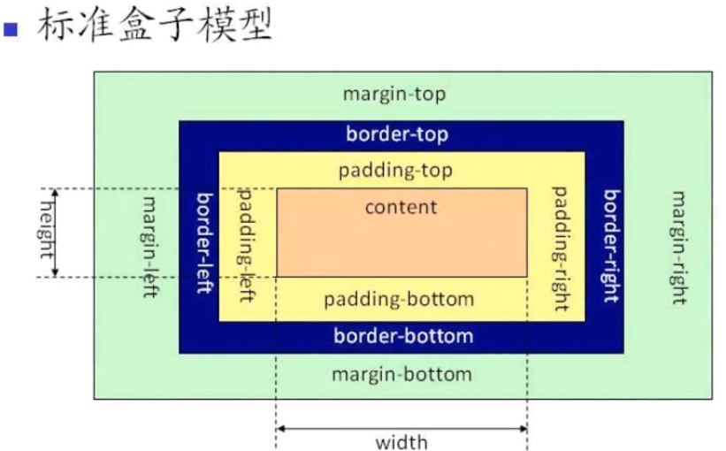
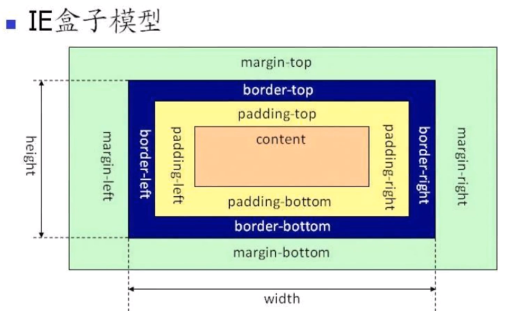
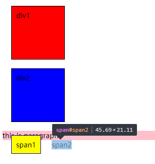
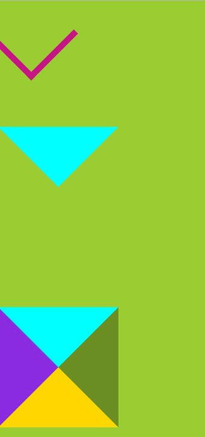

# 盒模型

## 盒模型概念

   
   

总元素的宽度=content宽度+左填充+右填充+左边框+右边框+左边距+右边距   
总元素的高度=content高度+顶部填充+底部填充+上边框+下边框+上边距+下边距   
W3C 标准中，padding、border 所占空间不在width、height范围内，  
IE 盒模型中width包括content、padding和border   


IE盒模型：width = content宽度+左填充+右填充+左边框+右边框   


### box-sizing
取值：  
content-box: w3c 标准盒模型  
border-box: IE 盒模型  


### paddding
padding:内边距，四个方向可以合写，也可以单独写，其值可以是px，也可以是百分比（相对于父容器）
- 行内元素的上下paddding 不起作用，左右paddding起作用，但是，如果添加了边框、背景能看到被padding撑开，但实际的行内元素的高度未变化；   
块元素的上下左右paddding均起作用   

### 盒模型的小应用-制作三角形和箭头

```
<!DOCTYPE html>
<html lang="en">
<head>
    <meta charset="UTF-8">
    <title>Title</title>
    <style>
        *{
            margin: 0px;
            padding: 0px;
        }
        body{
            background: yellowgreen;
        }
        div.arrow{
            height: 100px;
            width:100px;
            border-top:10px solid mediumvioletred;
            border-left:10px solid mediumvioletred;
            transform: rotate(225deg);
        }
        div.triangle{
            margin-top: 100px;
            height: 0px;
            width:0px;
            border-width: 100px;
            border-style:solid;
            border-color: aqua transparent transparent transparent;
        }
        div.rectangle{
            margin-top: 100px;
            height: 0px;
            width:0px;
            border-width: 100px;
            border-style:solid;
            border-color: aqua olivedrab gold blueviolet;

        }
    </style>
</head>
<body>
    <div class="arrow"></div>
    <div class="triangle"></div>
    <div class="rectangle"></div>
</body>
</html>
```
### 效果图
 

### margin
margin：外边距,四个方向可以合写，也可以单独写，其值可以是px，也可以是百分比（相对于父容器）,还可以是负值   
- 行内元素的上下margin 不起作用，左右margin起作用，块元素的上下左右margin均起作用   

1. 父级和第一个/最后一个子元素，它们之间的margin值取2者间较大的那个margin值
2. 父级和第一个/最后一个子元素, 如下3 种设置是等效的
    - 对于 margin-top 合并，可以进行如下操作（满足一个条件即可）：
    - 父元素设置为块状格式化上下文元素，如 overflow: hidden
    - 父元素设置 border-top 值；
    - 父元素设置 padding-top 值；
    - 父元素和第一个子元素之间添加内联元素进行分隔。


```
<div class="father">    <div class="son" style="margin-top:80px;"></div> </div>
<div class="father" style="margin-top:80px;">    <div class="son"></div> </div>
<div class="father" style="margin-top:80px;">    <div class="son" style="margin-top:80px;"></div> </div>
```
3. margin负边距的作用
```
<!DOCTYPE html>
<html lang="en">
<head>
    <meta charset="UTF-8">
    <title>margin负边距</title>
    <style type="text/css">
        .wrapper{
            width: 1000px; /*父元素不加该属性，下方 margin: 50px auto起不到居中效果*/
            margin: 50px auto;
        }
        .left{
            float: left;
            height: 400px;
            width: 200px;
            background: rebeccapurple;
        }
        .right{
            float: left;
            height: 400px;
            width: 400px;
            background: lightseagreen;
            margin-left: -600px;
        }
    </style>
</head>
<body>
    <div class="wrapper">
        <div class="left"></div>
        <div class="right"></div>
    </div>
</body>
</html>
```


