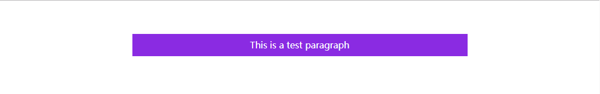

# 背景

## 背景颜色background-color
* 可简写为background
* 默认值为transparent
* 可取属性值，color_name、transparent、inherit
### 示例
```
<!DOCTYPE html>
<html lang="en">
<head>
    <meta charset="UTF-8">
    <title>Title</title>
    <style>
        p{
            height: 40px;
            width:600px;
            background-color: blueviolet;
            color: white;
            text-align: center; /*文字居中*/
            line-height:40px; /*行高与width一致，保证文字上下居中*/
            margin:60px auto;/*块居中*/
        }
    </style>
</head>
<body>
    <p >This is a test paragraph</p>
</body>
</html>
```

### 效果
 

## 背景图片background-img
* url 图片的url
* 默认值为none
* 可取属性值，url、none、inherit
### 示例
```
<!DOCTYPE html>
<html lang="en">
<head>
    <meta charset="UTF-8">
    <title>Title</title>
    <style>
        .logo a{
            background-image: url(http://www.baidu.com/img/baidu_jgylogo3.gif);
            display: block; /*a标签默认行内元素，设置宽、高不起作用*/
            height: 38px;
            width: 117px;
            text-indent: -9999px;
        }
    </style>
</head>
<body>
    <h1 class="logo">
        <a href="#">baidu</a>
    </h1>
</body>
</html>
```

### 效果
 

## 背景重复background-repeat
* 指定如何重复背景图片
* 默认值为 水平和垂直方向均重复
* 可取属性值，repeat、repeat-x（水平重复）、repeat-y（垂直方向重复）、no-repeat、inherit


## 背景位置background-position
* 指定背景图片起始位置
* 第一个值为x（水平） 方向的值，第二个为y（垂直）方向的值
* 可取属性值，数值（如10px 20px），关键字（left、right、top、bottom、center，如果只写一个，另一个自动认为是center）
   百分比（左上角为0% 0% ,如果只指定一个，另一个是50%）、inherit
### 示例
```
<!DOCTYPE html>
<html lang="en">
<head>
    <meta charset="UTF-8">
    <title>Title</title>
    <style>
        .logo{
            background: blueviolet url(http://www.baidu.com/img/baidu_jgylogo3.gif) no-repeat 50px 10px;
            height:200px;
            width:200px;
            text-indent: -9999px;
        }
    </style>
</head>
<body>
<h1 class="logo">
</h1>
</body>
</html>
```

### 效果
 

## 背景位置background-attachment
* 指定背景图片是否固定或随着页面的其余部分滚动
* scroll：背景图片随页面的其余部分滚动。这是默认
* fixed：背景图像是固定的
* inherit：继承

## 设置对象的背景图像尺寸background-size
* 指定对象的背景图片的大小
* 可取的值：长度（如 100px 200px,只背景图片实际的大小) ,百分比（指容器的宽高百分比）、auto（背景图片原尺寸）
   cover（等比拉伸或压缩图片，使得图片完全覆盖容器，可能超出容器）、
   contain（等比拉伸或压缩图片，使得图片某一条边达到容器的边，背景图片始终被包含在容器中）
* fixed：背景图像是固定的
* inherit：继承
* css3新增（不能放入background复合属性）

## 背景裁剪background-clip
* 取值，padding-box（裁剪掉border部分），border-box（裁剪掉border外部分，实际全保留）
  content-box（裁减掉border、padding覆盖的部分）、text
* css3新增（不能放入background复合属性）

## 背景裁剪background-origin
* 取值，取值，padding-box（从padding区域开始显示背景图片，含padding），border-box（从border区域开始显示背景图片，含border）
       content-box（从content区域开始显示背景图片，含content）
* css3新增（不能放入background复合属性）