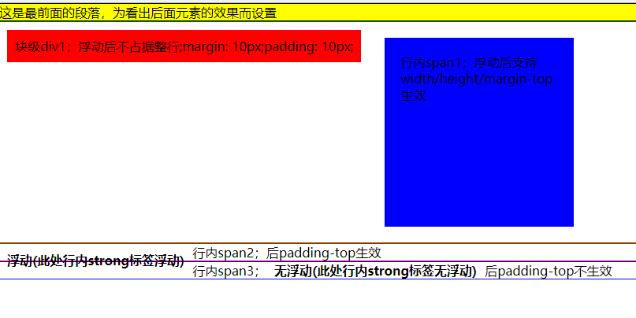

# 浮动
## 浮动元素特点
1. 浮动元素在一行显示
2. float值为left的元素，会依次从左向右排布；float值为right的元素，会依次从右向左排布；
3. 浮动元素自动具有类似 inline-block元素的属性
4. 浮动元素脱离文档流，浮动元素后面的元素，不能识别浮动元素的高度和位置（从而会占据浮动元素原来的位置）
5. 浮动元素的子元素，不会继承浮动
6. float可取的值，left，right，none，inherit


## 文档流
1. 文档流：指的是元素排版过程中，元素自动从左向右，从上向下流式排列。最终窗体自上而下分成一行行，并在每行中从左向右排放元素；
2. 脱离文档流：文档流内的正常元素无法识别脱离文档流的元素（脱离文档流的元素相当于漂浮在文档流之上）


## 浮动影响

### 对行内元素影响
行内元素设置成浮动之后变得更加像是inline-block（行内块级元素，设置成这个属性的元素会同时拥有行内和块级的特性，最明显的不同是它的默认宽度不是100%），
这时候给行内元素设置padding-top和padding-bottom或者width、height都是有效果的

### 对块级元素影响
给块级元素设浮动的时候也是同样的情况，属性更加像是inline-block；浮动后不占据整行，其宽度由内容撑开


```
    <style>
        *{
            margin: 0;
            padding: 0;
            font-size: 16px;
        }
        p{
            border: 1px solid black;
            background: yellow;
        }
        .box1{
            border: 1px solid green;
            overflow: hidden; /* 触发BFC */
        }
        .div1{
            float: left;
            background: red;
            margin: 10px;
            padding: 10px;
        }
        .span1{
            float: left;
            background: blue;
            width: 200px;
            height: 200px;
            margin: 20px;
            padding: 20px;
        }
        .box2{
            border: 1px solid red;
        }
        .box2 strong{
            float: left;
            padding: 10px;
        }

        .box3{
            border: 1px solid blue;
        }
        .box3 strong{
            padding: 10px;
        }
    </style>
</head>
<body>
<p>这是最前面的段落，为看出后面元素的效果而设置</p>
    <div class="box1">
        <div class="div1">块级div1；浮动后不占据整行;margin: 10px;padding: 10px;</div>
        <span class="span1">行内span1；浮动后支持width/height/margin-top生效</span>
    </div>
<div class="box2">
    <span class="span2">行内span2；<strong>浮动(此处行内strong标签浮动)</strong>后padding-top生效</span>
</div>
<div class="box3">
    <span class="span3">行内span3；<strong>无浮动(此处行内strong标签无浮动)</strong>后padding-top不生效</span>
</div>
</body>

```



### 对外边距影响
- 浮动元素周围的外边距不会合并
  （1-3两个浮动元素外边距不合并.html）
- 子级元素浮动后，自己的margin-top不传递给父级
   （1-4浮动元素外边距不传递给父级.html）
   
### 浮动与负边距  
两个浮动元素，如果因为放不下导致其中一个浮动元素下移，对下移的元素设置负margin值大于自身的宽度，可将其上移。
如圣杯布局、双飞翼布局

   

## 清浮动

clear 清除

取值: left | right | both | none（默认） | inherit
应用于: 块级元素(块级元素指block元素，不包括inline-block元素)
继承性: 无

left:左侧不允许存在浮动元素
right:右侧不允许存在浮动元素
both:左右两侧不允许存在浮动元素
none:允许左右两侧存在浮动元素

 __设置clear属性的元素并不能改变浮动元素，而只能改变自身__


1. 给浮动元素的父元素手动添加一个固定的高度；
2. 给浮动元素的父元素设置overflow:hidden/auto ;加 overflow:visible; 不可行，加overflow:scroll;,清除了浮动，但有滚动条
3. 浮动元素父元素结束标签之前加一个具有块元素特点的标签（一般用div），添加clear:both 即<div style="clear:both:>
4. 利用clearfix清除浮动
          .clearfix:after{ /*可以多处使用----项目常用方式*/
              display: block;
              clear: both;
              content: "";

              /*低版本浏览器 默认有height：1px*/
              height: 0;
              font-size: 0;
              overflow: hidden;
              visibility: hidden;
          }


### 浮动与inline-block选择
- inline-block优势：不需要清除浮动，简单易用，在设置居中时更为方便，适合盒子内容不多的元素水平排列； 
- inline-block劣势：需要注意缝隙，注意对齐，ie8以下不支持
- float优势：兼容性好，没有缝隙问题  
- float劣势：需要清除浮动，适合稍大的布局

### 浮动与定位选择
- 一般大布局、自适应采用浮动
- 一般小元素、固定宽高采用定位
- 具体视情况而定是关键
