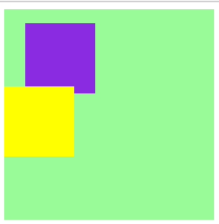

# 定位

## 绝对定位 postion:absolute
1. 可设置top、bottom、left、right值
2. 绝对定位元素脱离正常文档流（后面的元素会占据它原来的位置）,
3. 绝对定位元素的参照物为最近的具有定位属性的父元素（定位属性包含relative，fixed,absolute;如果没有，则为html根元素）
4. 如果同时设置top和bottom，只有top起作用；如果同时设置left和right，只有left起作用

```
<!DOCTYPE html>
<html lang="en">
<head>
    <meta charset="UTF-8">
    <title>Title</title>
    <style>
        .outer{
            height: 300px;
            width: 300px;
            background: rebeccapurple;
            /*position:relative;*/
        }
        .middle{
            height: 200px;
            width: 200px;
            background: yellowgreen;
            position:relative;
            left: 10px;

        }
        .inner{
            height: 100px;
            width: 100px;
            background: mediumvioletred;
            position: absolute;
            left: 50px;
            bottom: 0;
        }
    </style>
</head>
<body>
    <div class="outer">
        <div class="middle">
            <div class="inner"></div>
        </div>
    </div>
</body>
</html>
```
## 绝对定位例子
```
<!DOCTYPE html>
<html lang="en">
<head>
    <meta charset="UTF-8">
    <title>Title</title>
    <style>
        .pic{
            position: relative;
            width: 200px;
            height: 200px;;
        }
        .pic img{
            display: block;
            width: 100%;
            height: 100%;

        }
        .pic .bg{
            position: absolute;
            bottom: 0;
            left:0;
            width: 200px;
            height: 50px;
            background: rgba(0,0,0,0.5);
        }
        .pic .txt{
            position: absolute;
            height: 50px;
            line-height:50px;
            text-align: center;
            font-size: 16px;
            color: aquamarine;
            bottom:0;
            left: 0;
            width: 200px;
        }
    </style>
</head>
<body>
    <div class="pic">
        
        <div class="bg"></div>
        <div class="txt">Welcome</div>
    </div>
</body>
</html>
```
 

## 相对定位 position:relative
* 不会脱离文档流，占位，后面的元素不会占据其原来的位置
* 如果同时设置top和bottom，只有top起作用；如果同时设置left和right，只有left起作用
* 其参照物为自身
* 相对定位元素的 margin / padding会让该文档空间产生偏移（和没有设置position效果/默认position 时一样）

```
<!DOCTYPE html>
<html lang="en">
<head>
    <meta charset="UTF-8">
    <title>Title</title>
    <style>
        .outer{
            height: 300px;
            width: 300px;
            background: palegreen;
        }
        .inner1{
            height: 100px;
            width: 100px;
            background: blueviolet;
            position: relative;
            left:20px;
            top: 20px;
            margin:10px;
            z-index: 0;

        }
        .inner2{
            height: 100px;
            width:100px;
            background: yellow;
            position: relative;
            z-index: 1; /*设置position,该属性生效*/
        }
    </style>
</head>
<body>
    <div class="outer">
        <div class="inner1"></div>
        <div class="inner2"></div>
    </div>
</body>
</html>
```
 


## 相对定位 position:fixed
* 会脱离文档流
* 如果同时设置top和bottom，只有top起作用；如果同时设置left和right，只有left起作用
* 参照物：整个浏览器窗口
* 可以设置z-index改变层级，值越大，越在上层

## z-index
1.


