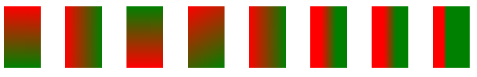
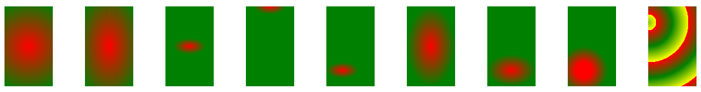

# 渐变
## 线性渐变
linear-gradient
1. 只能用在背景上
2. 颜色沿着一条直线轴变化
3. 参数
   - 起点：沿着什么方向渐变（left、top、left top等）
   - 角度：xxx deg
   - 点：渐变的颜色和位置 （X% px ）

 重复线性渐变：
 repeating-linear-gradient

```
        div{
            height: 50px;
            width: 30px;
            background:blueviolet;
            margin: 10px;
            float: left;
        }
        div:nth-child(1){
            background: -webkit-linear-gradient(top,red,green); /*top:从上到下*/
            linear-gradient(top,red,green);
        }
        div:nth-child(2){
            background: -webkit-linear-gradient(left,red,green);/*left:从左到右*/
            linear-gradient(left,red,green);
        }
        div:nth-child(3){
            background: -webkit-linear-gradient(bottom,red,green);/*left:从下到上*/
            linear-gradient(bottom,red,green);
        }
        div:nth-child(4){
            background: -webkit-linear-gradient(left top,red,green);/*left top:从左上到右下*/
            linear-gradient(left top,red,green); /*left top:从左上到右下*/
        }

        div:nth-child(5){
            background: -webkit-linear-gradient(0deg,red,green);/*0deg:水平方向 （从左到右）*/
            linear-gradient(0deg,red,green); /*left top:从下往上*/
        }

        div:nth-child(6){
            background: -webkit-linear-gradient(0deg,red 30%,green 70%);/*0deg:水平方向 （从左到右）,10%-70%渐变，10%前纯红色，70%后面纯绿色*/
            linear-gradient(0deg,red 30%,green 70%); /*0deg:水平方向 （从左到右）,10%-70%渐变，10%前纯红色，70%hou纯绿色*/
        }

        div:nth-child(7){
            background: -webkit-linear-gradient(0deg,red 10px,green 20px );/*0deg:水平方向 （从左到右）,10%-70%渐变，10px前纯红色，70px后面纯绿色*/
            linear-gradient(0deg,red 10px,green 20px); /*0deg:水平方向 （从左到右）,10%-70%渐变，10px前纯红色，70px后面纯绿色*/
        }
        div:nth-child(8){
            background: -webkit-linear-gradient(0deg,red 10px,green 10px );/*0deg:水平方向 （从左到右）,无渐变，10px前纯红色，10px后面纯绿色*/
        linear-gradient(0deg,red 10px,green 10px); /*0deg:水平方向 （从左到右）,无渐变，10px前纯红色，10px后面纯绿色*/
        }
```
 


## 径向渐变
radial-gradient([[<shape>||<size>][at <position>]?,|at <position>]?<color-stop>[<color-stop>]+)
1. 从一个点向多方向颜色渐变
2. shape：ellipse、circle或设置水平半径，垂直半径
3. size：渐变的大小，即渐变到哪里停止
   closest-side;farthest-side;closest-corner;farthest-corner
4. position:关键词|数值|百分比
5. 重复的径向渐变
```
        div{
            height: 50px;
            width: 30px;
            background:blueviolet;
            margin: 10px;
            float: left;
        }
        div:nth-child(1){
            background: radial-gradient(circle,red,green);
            /*径向渐变形状为圆形*/
        }

        div:nth-child(2){
            background: radial-gradient(ellipse,red,green);
            /*径向渐变形状为椭圆形*/
        }

        div:nth-child(3){
            background: radial-gradient(10px 5px,red,green);
            /*径向渐变水平方向10px,垂直方向5px，默认在中心*/
        }
        div:nth-child(4){
            background: radial-gradient(10px 5px at top ,red,green);
            /*径向渐变水平方向10px,垂直方向5px，在顶端中心*/
        }
        div:nth-child(5){
            background: radial-gradient(10px 5px at 10px 40px ,red,green);
            /*径向渐变水平方向10px,垂直方向5px，在水平方向10px、垂直方向40px处*/
        }
        div:nth-child(6){
            background: radial-gradient(closest-side ,red,green);
            /*径向渐变到最近的边，在中心处*/
        }

        div:nth-child(7){
            background: radial-gradient(closest-side at 15px 40px ,red,green);
            /*径向渐变到最近的边(圆心在水平方向10px,垂直方向40px）*/
        }
        div:nth-child(8){
            background: radial-gradient(circle at 10px 40px ,red 5px ,green 15px);
        /*径向渐变圆心在水平方向10px,垂直方向40px,5px以内为纯红色，15px以外为纯绿色，中间为渐变*/
        }
        div:nth-child(9){
            background: repeating-radial-gradient(circle at 0px 10px ,red 5px ,green 15px,yellow 25px);
            /*径向渐变圆心在水平方向0px,垂直方向10px, 颜色根据半径值交替变化*/
        }
```
 


