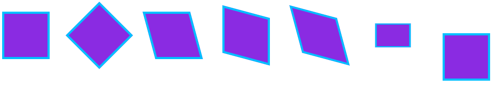

# transition
1. transition-property：过渡属性
2. transition-duration：过渡时间
3. transition-delay：延迟时间
transition-timing-function 运动类型
  - ease 逐渐变慢（默认值）
  - linear：匀速
  - ease-in ：加速
  - ease-out：减速
  - ease-in-out：先加速后减速
  - cubic-bezier：贝塞尔曲线

```
<style>
      div:nth-child(1){
          width: 100px;
          height: 100px;
          background: red;
         /* transition:width 500ms 1s ease-in-out;*/ /*鼠标划入、划出均执行该动画*/
      }
      div:nth-child(1):hover{
          width: 200px;
/*        transition-property:width;
          transition-duration: 500ms;
          transition-delay: 1s;
          transition-timing-function:ease-in-out;*/
          transition:width 500ms 1s ease-in-out; /*等价上面属性*/
      }
  </style>
</head>
<body>
  <div></div>
  <div></div>
</body>
```


# box-shadow

1. h-shadow	必需。水平阴影偏移的位置。允许负值。
2. v-shadow	必需。垂直阴影偏移的位置。允许负值。
3. blur	可选。模糊距离。
4. spread	可选。阴影的尺寸。
5. color	可选。阴影的颜色。
6. inset	可选。将外部阴影 (outset) 改为内部阴影。

```
<style>
    body{
        background: #2192bc;
    }
    .box{
        width: 200px;
        height: 200px;
        border-radius: 50%;
        background: #2c9dc4 url(./画笔.png);
        margin: 0 auto;
        box-shadow: 0 0 10px 10px transparent;
        transition: box-shadow 0.5s 0s ease-in-out ;
    }
    .box:hover{
        box-shadow: 0 0 10px 10px rgba(255,255,255,0.4) ;
    }
</style>
</head>
<body>
    <div class="box"></div>
</body>
```
# transform
1. rotate
  - deg
  - Transform-origin 旋转基点
2. skew 倾斜函数
   - skewX
   - skewY
3. scale 缩放函数
  - scaleX
  - scaleY

4. translate 位移函数
   - translateX
   - translateY

```
        div{
            float: left;
            border: solid 5px deepskyblue;
            height: 100px;
            width: 100px;
            margin: 30px;
            background: blueviolet;
        }

        div:nth-child(2){
            transform: rotate(45deg);
        }
        div:nth-child(3){
            transform:skew(15deg,0deg);
        }
        div:nth-child(4){
            transform:skew(0deg,15deg);
        }
        div:nth-child(5){
            transform:skew(15deg,15deg);
        }
        div:nth-child(6){
            transform:scale(0.75,0.5);
        }
        div:nth-child(7){
            transform:translate(0,50px);
        }

```

 

# animation
animation: name duration timing-function delay iteration-count direction;
1. animation-name	规定需要绑定到选择器的 keyframe 名称。。
2. animation-duration	规定完成动画所花费的时间，以秒或毫秒计。
3. animation-timing-function	规定动画的速度曲线。
   - inear	动画从头到尾的速度是相同的。
   - ease	默认。动画以低速开始，然后加快，在结束前变慢
   - ease-in	动画以低速开始
   - ease-out	动画以低速结束
   - ease-in-out	动画以低速开始和结束
   - cubic-bezier(n,n,n,n)
4. animation-delay	规定在动画开始之前的延迟。
5. animation-iteration-count	规定动画应该播放的次数。
   - n	定义动画播放次数的数值
   -  infinite
6. animation-direction	规定是否应该轮流反向播放动画。
   - normal	默认值。动画应该正常播放。
   - alternate
   - reverse
   - alternate-reverse
7. animation-play-state 动画状态
   - running|paused
8. animation-fill-mode 动画结束后的状态
   - none、forwards、backwards、both
      forwards：动画结束停留在最后一帧
      backwards：动画立即从第一帧开始

关键帧 - @keyframes
 - 时间单位
  数字：0%、25%、100%
  字符：from（0%）、to(100%)
格式
  @keyframes 动画名称
   {
        动画状态
   }

